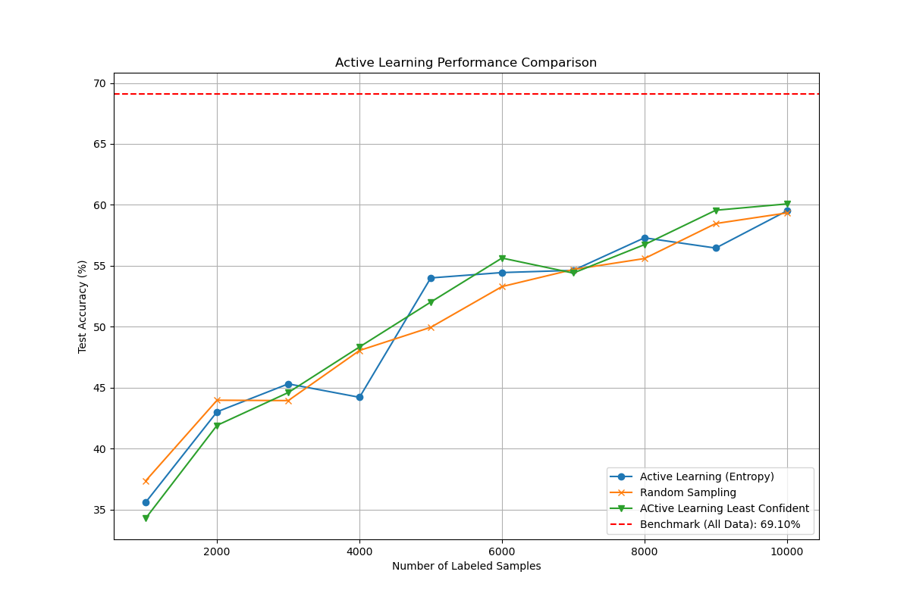

## How to Run the Experiment

1.  **Set up the Environment:** use conda env..

    # create env from requirments
    conda create --name active_env --file requirements.txt

    # activate the env
    conda activate active_env
    

## How do we select which data to add into our training data. 
    two primary uncertainty sampling strategies:

* **1- Least Confident Sampling** 
* **2- Entropy-Based Sampling** 

## Resources:

* **[Active Learning by Burr Settles](http://burrsettles.com/pub/settles.activelearning.pdf)**: a very old survey 

* **[A Practical Guide to Active Learning for Computer Vision (Encord Blog)](https://encord.com/blog/active-learning-computer-vision-guide/)**: gray literature 